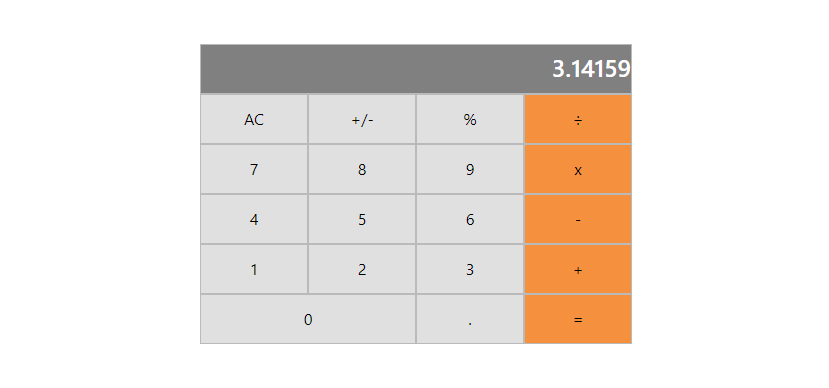

# React Calculator
A simple calculator project that's built with React.


## Project Description
This is a practice project built to have hands-on experience with React. It uses basic components and hooks to build a simple calculator.
Users can interact with the calculator to do basic math operations.


## Screenshot of the page



## Live Version
https://boring-johnson-931edb.netlify.app/

## Built With

- HTML
- CSS
- JAVASCRIPT
- BOOTSTRAP
- REACT

## Getting Started

1. Open Terminal.
2. Navigate to your desired location to download the contents of this repository.
3. Copy and paste the following code into the Terminal: git clone https://github.com/Zibilyonik/react-calculator.git
4. ```cd react-calculator```.
5. Install the required node modules by running `npm install` command.
6. After installing all the required node modules, you can run the project on your own server using `npm run start`.


## Contributors

👤 **Onur Onat Surmeli**

- [GitHub](https://github.com/Zibilyonik)
- [Twitter](https://twitter.com/OnurSurmeli2)
- [LinkedIn](https://www.linkedin.com/in/onuronatsurmeli/)

## Contributing

You're welcome to inform me about any issues you may have found by checking the [issues](../../issues) page.
You can also let me know if you have any feature requests via the links you can find on the [Contributors](#Contributors) section.

## Show Your Support

I hope you like the project! You can show your support by dropping a :star: on it or giving feedback on the project.

## Thank You
Thank you for checking the project. Have a nice day!


